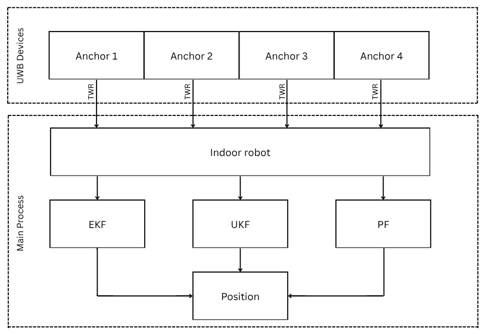
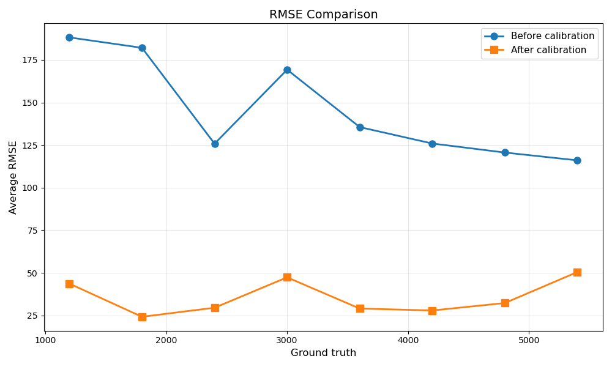
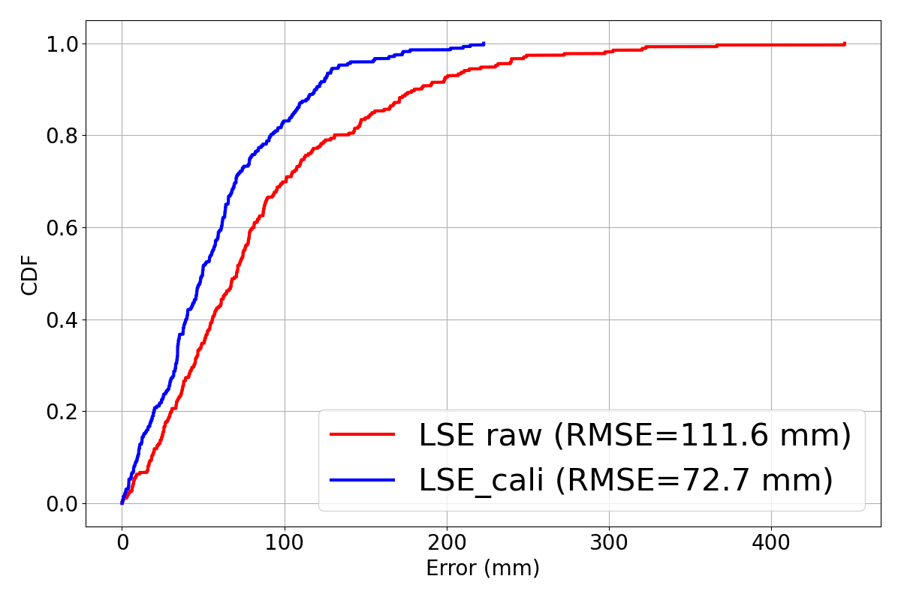
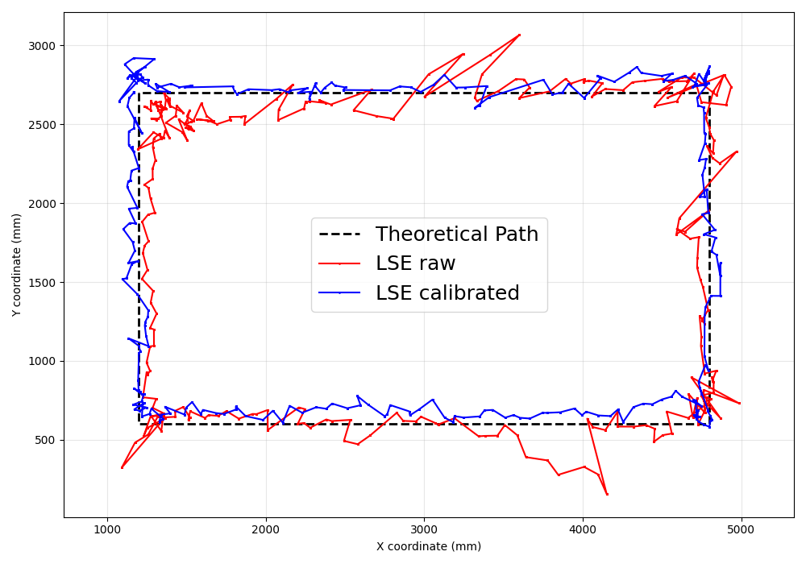
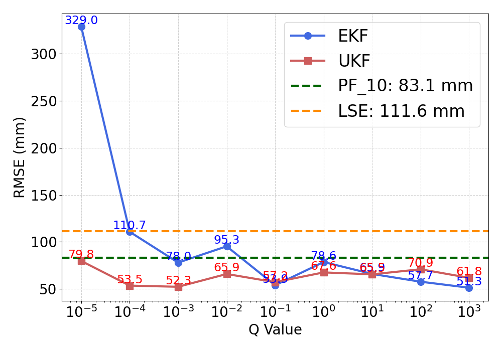
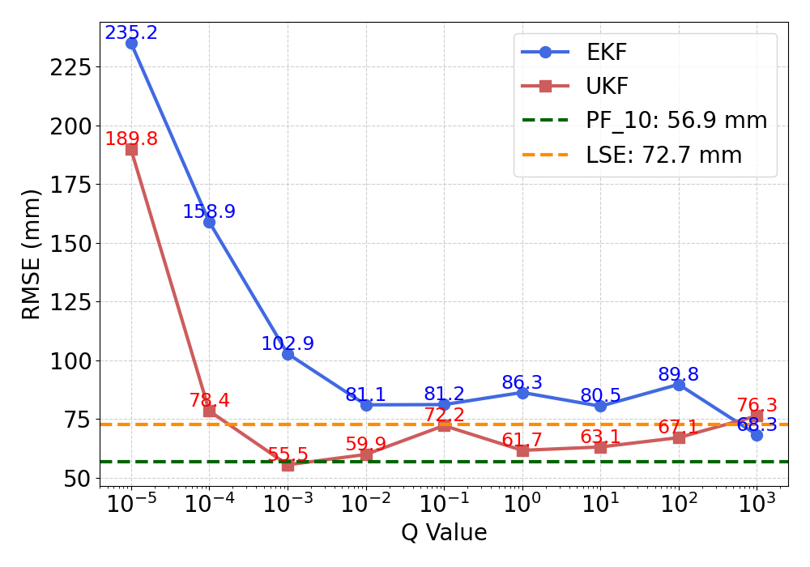
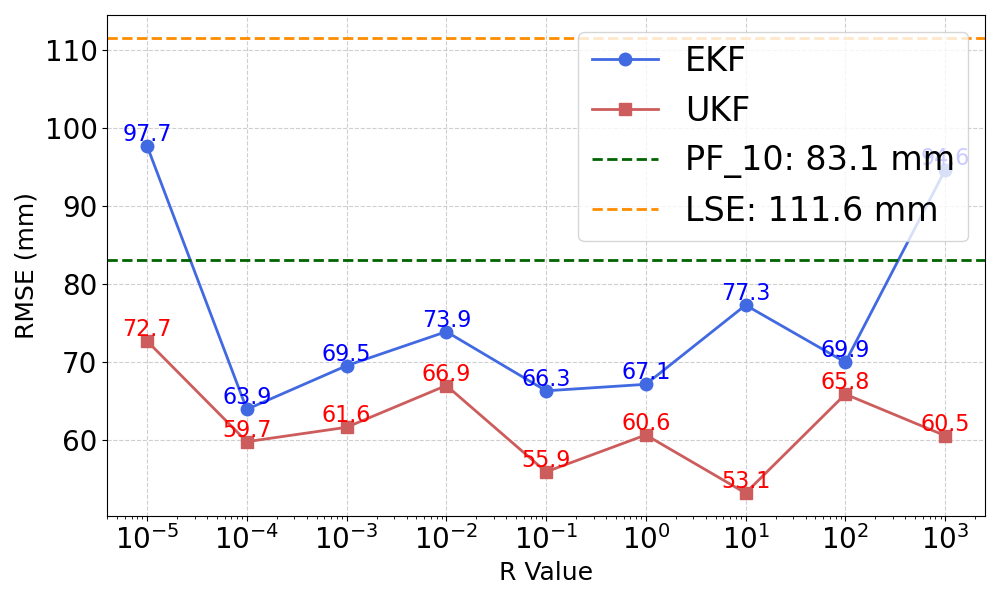
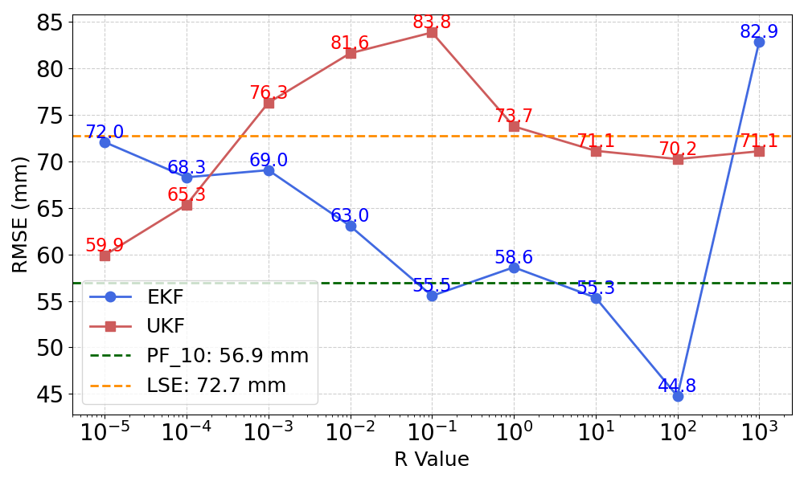

# UWB-API

> Evaluation of State Estimation Filters for Indoor Robot Positioning

## Abstract

This study evaluates three state estimation algorithms — **EKF**, **UKF**, and **PF** — for UWB-based indoor robot positioning where GPS is unavailable.

| Filter | Strength | Weakness |
|--------|----------|----------|
| EKF | Fast, low computational cost | Sensitive to noise & nonlinearity |
| UKF | Balanced accuracy & efficiency | Moderate complexity |
| PF  | Handles non-Gaussian noise well | High computational cost |

**Keywords:** UWB, indoor positioning, localization, Kalman filter, particle filter

---

## 1. System Overview

### Architecture

4 fixed UWB **Anchors** communicate via TWR with a mobile **Tag** on the robot. The Raspberry Pi 4 runs EKF, UKF, and PF in parallel to estimate position.

| Component | Detail |
|-----------|--------|
| UWB module | DWM1001 (UWB + ARM Cortex-M4 + BLE) |
| Update rate | Up to 160 Hz, `dt = 0.1 s` |
| Test area | ~5.5 m × 5 m (LOS) |
| Anchor layout | A1=(0,0), A2=(5470,0), A3=(5420,5050), A4=(770,5050) mm |
| Robot speed | 0.5 m/s, rectangular trajectory A→B→C→D→A |

---

## 2. Mathematical Model

### State Vector (2D Constant-Velocity)

$$\mathbf{x}_k = [x_k,\ y_k,\ v_{x,k},\ v_{y,k}]^\top$$

### State Transition

$$\mathbf{x}_{k+1} = \mathbf{F}\,\mathbf{x}_k + \mathbf{w}_k, \quad \mathbf{w}_k \sim \mathcal{N}(0, \mathbf{Q})$$

### Measurement Model (nonlinear — distance to each anchor)

$$z_{i,k} = \sqrt{(x_k - x_{a_i})^2 + (y_k - y_{a_i})^2} + v_{i,k}$$

---

## 3. Algorithms

### Initialization — Least-Squares Estimation (LSE)

$$\mathbf{x}_\text{LS} = (\mathbf{A}^\top\mathbf{A})^{-1}\mathbf{A}^\top\mathbf{b}$$

Used to bootstrap all three filters with a reliable initial position.

### EKF
Linearizes the measurement function via Jacobian at each step. Fast but sensitive to tuning of **Q** and **R**.

### UKF
Uses **2n+1 = 9 sigma points** ($\alpha=0.1$, $\kappa=1.0$, $\beta=2$) — no Jacobian required. More robust than EKF across a wider parameter range.

### Particle Filter (PF)
Monte Carlo approximation with $N$ particles. Weights updated via Gaussian likelihood; resampling triggered when $N_\text{eff}$ drops below threshold.

---

## 4. Bias Calibration

Linear model per anchor: $d' = m \cdot d + c$, fitted over 1.2–5.4 m (step 0.6 m, 5000 samples each).

### Ranging RMSE Before vs. After Calibration

Before calibration RMSE is ~125–185 mm with high variance across distances. After calibration it drops to ~25–50 mm and stabilizes significantly.

### LSE Positioning — CDF Before vs. After Calibration

| Metric | LSE Raw | LSE Calibrated |
|--------|:-------:|:--------------:|
| RMSE | 111.6 mm | **72.7 mm** |
| Error reduction | — | **~35%** |
| CDF @ 100 mm | ~65–70% | ~80–85% |

### Tracking Path Comparison

Calibrated LSE (blue) follows the theoretical trajectory (dashed) much more closely. Raw LSE (red) shows large deviations, especially at corners and along straight segments.

---

## 5. Results

### Scenario 1 — PF: Particle Count vs. Performance

| Particles | Sampling Rate (Hz) | RMSE Raw (mm) | RMSE Calibrated (mm) |
|:---------:|:------------------:|:-------------:|:--------------------:|
| **10**    | **128**            | **83.1**      | **56.9**             |
| 30        | 119                | 106.6         | 64.5                 |
| 50        | 108                | 100.8         | 73.8                 |
| 70        | 94                 | 107.5         | 76.3                 |
| 90        | 87                 | 109.8         | 63.9                 |

> **Finding:** More particles → lower update rate → worse convergence per motion segment. **10 particles** achieves the best accuracy/speed trade-off in both raw and calibrated cases.

---

### Scenario 2 — EKF/UKF Sensitivity to Q and R

#### Varying Process Noise Q — Raw Data

| Filter | Best Q | Min RMSE | Behavior |
|--------|:------:|:--------:|----------|
| EKF | $10^3$ | 51.3 mm | High sensitivity — RMSE swings from 329 mm to 51 mm |
| UKF | $10^{-3}$ | 52.3 mm | Stable — stays within 52–80 mm across all Q |

#### Varying Process Noise Q — Calibrated Data

| Filter | Best Q | Min RMSE | Behavior |
|--------|:------:|:--------:|----------|
| EKF | $10$ | 80.5 mm | Still sensitive — starts at 235 mm, non-monotonic |
| UKF | $10^{-3}$ | **55.5 mm** | Robust — stays below 80 mm for most Q values |

> After calibration, UKF at optimal Q (55.5 mm) slightly edges out PF (56.9 mm) and clearly beats LSE (72.7 mm).

---

#### Varying Measurement Noise R — Raw Data

| Filter | Best R | Min RMSE | Behavior |
|--------|:------:|:--------:|----------|
| EKF | $10^{-4}$ | 63.9 mm | Moderate variation (63.9–97.7 mm) |
| UKF | $10$ | 53.1 mm | More stable, consistently lower than EKF |

#### Varying Measurement Noise R — Calibrated Data

| Filter | Best R | Min RMSE | Behavior |
|--------|:------:|:--------:|----------|
| EKF | $10^2$ | **44.8 mm** | Best single result — beats both PF and LSE |
| UKF | $10^{-5}$ | 59.9 mm | Consistent (59.9–83.8 mm), no sharp drops |

> After calibration + proper R tuning, EKF achieves the **lowest RMSE of all methods (44.8 mm)**. UKF is safer to deploy without precise tuning.

---

## 6. Conclusion

| Method | RMSE (calibrated) | Computation | Robustness |
|--------|:-----------------:|:-----------:|:----------:|
| LSE baseline | 72.7 mm | Very low | — |
| PF (10 particles) | 56.9 mm | Medium | High |
| UKF (optimal Q) | 55.5 mm | Low–Medium | **High** |
| EKF (optimal R) | **44.8 mm** | **Lowest** | Medium |

- **EKF** — best peak accuracy when R is properly tuned; diverges badly with small Q
- **UKF** — best robustness across wide Q/R ranges; recommended for practical deployment
- **PF** — 10 particles is optimal; more particles degrades performance due to lower update rate
- **Bias calibration** is essential (~35% RMSE reduction across all methods)

### Future Work
- Learning-based state estimation (e.g., KalmanNet)
- SLAM integration for dynamic environments
- IMU/UWB sensor fusion

---

## References

1. Gamarra et al., *IPIN 2023* — Hybrid BLE AoA + GNSS seamless positioning
2. Huang et al., *ISPACS 2024* — NLOS impact on UWB 3D positioning
3. Joseph & Sasi, *ICCSDET 2018* — Indoor positioning via WiFi fingerprint
4. Mallick et al., *ICCAIS 2021* — Comparison of KF, EKF, UKF, CKF, PF in GMTI
5. Wei et al., *ICMSP 2023* — DS-TWR outdoor localization optimization
6. Moosavi & Ghassabian, *IntechOpen 2018* — Calibration curve linearity
7. Du, *ICAICE 2024* — UWB/BLE indoor positioning for hospitals
8. Feng et al., *IEEE IoT Journal 2020* — Kalman filter IMU+UWB integration
9. Revach et al., *IEEE TSP 2022* — KalmanNet neural-aided filtering
10. Duong et al., *TELKOMNIKA 2025* — UWB positioning with low-cost MCUs
